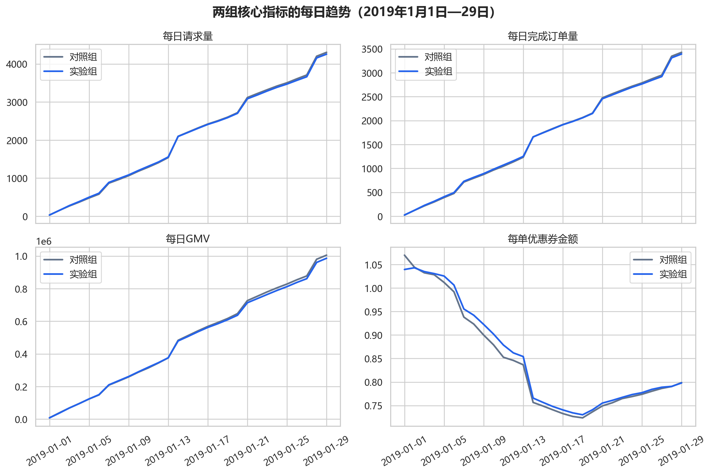
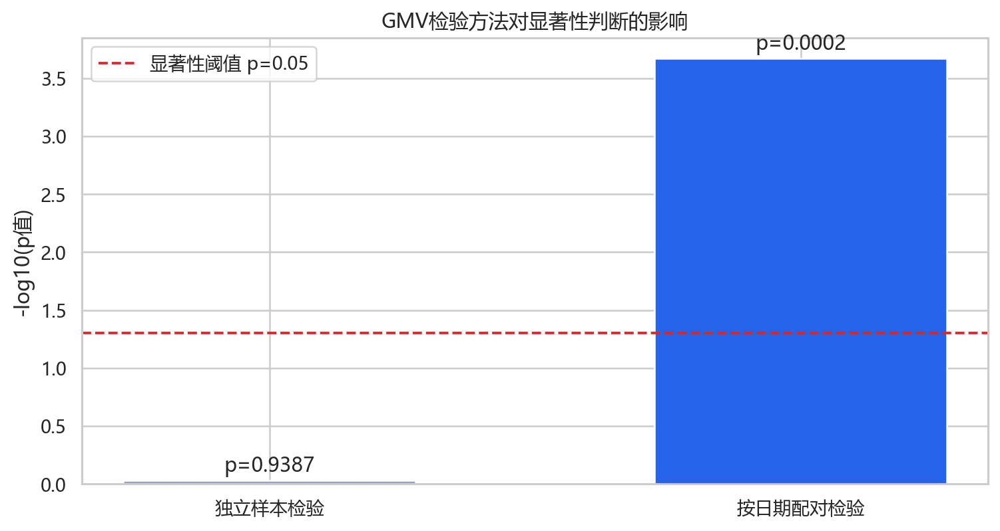
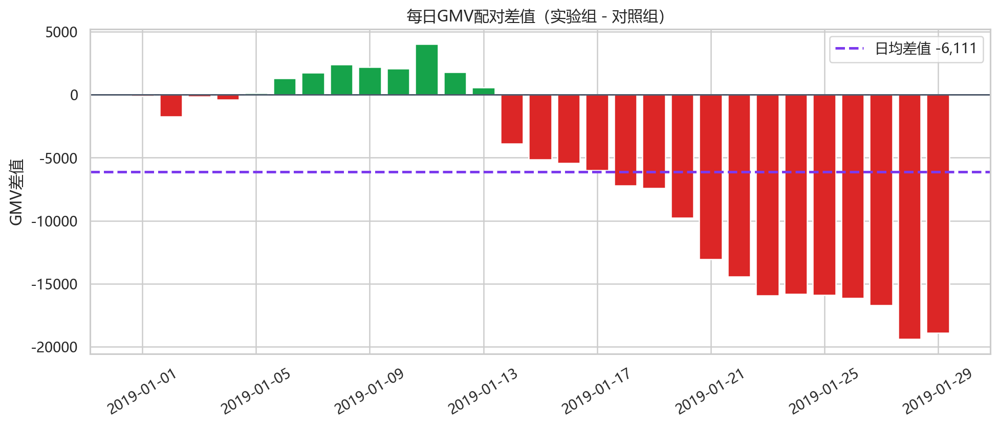
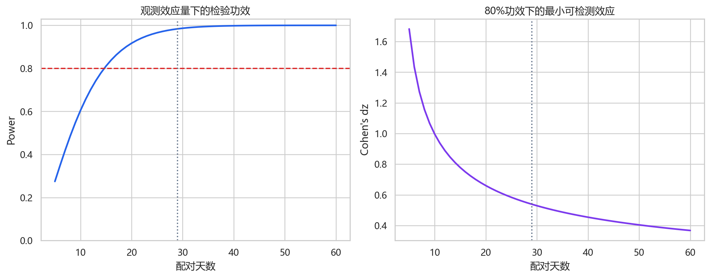

# 网约车优惠券 A/B 测试分析

基于 29 天日期级配对实验数据，评估“提高优惠券力度是否值得推广”。项目覆盖实验结构还原、业务指标诊断、配对检验、稳健性验证、功效分析与交互式 Dashboard。

> **决策结论：不建议直接推广当前优惠券方案。** 实验组的完成率和取消率有所改善，但请求数与订单数没有显著增长，GMV、客单价和补贴效率反而显著下降。

## 项目亮点

- 识别出对照组与实验组按日期一一对应，使用日期级配对检验消除共同的大盘波动。
- 复现“Welch 独立样本检验不显著，但配对检验显著负向”的结论反转。
- 同时评估增长、交易体验和补贴经济性，避免只根据单一 p 值做推广决策。
- 使用 Wilcoxon、20,000 次 Bootstrap、分阶段检验和功效分析验证结论稳健性。
- 提供可筛选日期、实时重算统计结果的 Streamlit Dashboard。

## 业务问题

平台提高每单优惠券金额，希望刺激用户请求和订单成交。分析重点回答：

1. 两组数据是否可比，应该使用独立样本检验还是配对检验？
2. 优惠券是否带来 requests、trips 和 GMV 增量？
3. 新增收益能否覆盖新增优惠券成本？
4. 策略是否以取消率或完成率恶化为代价？
5. 当前样本量是否足以支持业务结论？

## 数据与实验结构

数据文件为 [`data/test.xlsx`](data/test.xlsx)，包含 2019-01-01 至 2019-01-29 的 58 条记录：29 个日期 × 2 个实验组。

| 字段 | 含义 |
|---|---|
| `date` | 日期 |
| `group` | `control` / `experiment` |
| `requests` | 请求数 |
| `trips` | 完成订单数 |
| `gmv` | 成交总额 |
| `coupon per trip` | 每单优惠券金额 |
| `canceled requests` | 取消请求数 |

衍生指标：

- 完成率 = `trips / requests`
- 取消率 = `canceled requests / requests`
- 客单价 = `gmv / trips`
- 优惠券成本 = `coupon per trip × trips`
- 配对差值 = 同日期实验组指标 − 对照组指标

两组同一天的请求数、订单数和 GMV 呈现明显同步波动，因此日期是天然的配对单位。后续主检验采用配对 t 检验，并使用 Wilcoxon 符号秩检验验证稳健性。



## 核心结果

| 指标 | 对照组日均 | 实验组日均 | 实验组变化 | 配对检验 |
|---|---:|---:|---:|---:|
| GMV | 485,124 | 479,012 | **-1.26%** | **p=0.0002** |
| 客单价 | 300.24 | 295.34 | **-1.63%** | **p<0.001** |
| 完成率 | 80.19% | 80.38% | **+0.20 个百分点** | **p=0.0010** |
| 取消率 | 6.50% | 6.29% | **-0.21 个百分点** | **p<0.001** |
| 优惠券成本 | 1,286.52 | 1,296.41 | **+0.77%** | **p=0.0103** |

补充结果：

- 请求数下降 0.36%，p=0.111；完成订单数下降 0.16%，p=0.441，均没有显著增量。
- 实验期总 GMV 比对照组少 177,224，优惠券成本却增加 287。
- 绝对 ROI 下降约 2.41%，说明当前方案增加了补贴投入，但没有形成正向商业回报。

## 核心发现：配对结构改变统计结论

如果忽略日期对应关系，直接进行 Welch 独立样本 t 检验，GMV 的 p 值为 **0.9387**，会得到“两组没有显著差异”的结论。

按照日期进行配对后：

- 日均 GMV 差值：**-6,111**
- t 统计量：**-4.248**
- p 值：**0.0002**
- 95% 置信区间：**[-9,058, -3,164]**
- Cohen's dz：**-0.79**

日期配对消除了两组共同的大盘波动，使被噪声掩盖的系统性 GMV 下降显现出来。这是本项目最重要的方法论结论。





## 稳健性与时间异质性

- Wilcoxon 符号秩检验：p=0.0018，与配对 t 检验方向一致。
- 20,000 次 Bootstrap：GMV 日均差值 95% CI 为 **[-8,909, -3,394]**。
- 前 14 天：GMV 均值差 **+723**，p=0.194，不显著。
- 后 15 天：GMV 均值差 **-12,490**，p<0.001，显著下降。

负向效果主要集中在实验后半程。同时，两组每单优惠券金额都随时间下降，说明实验处理强度并不恒定。因此，本项目评估的是“当前优惠券变化路径”的总体效果，而不是某个固定券额增量的纯因果效应。

## 功效分析

- 29 个配对日下，观测效应对应的事后功效约 **98.4%**。
- 如果真实效应等于本次观测效应，约 **15 个配对日**可达到 80% 功效。
- 当前样本下，80% 功效对应的 GMV 最小可检测效应约为日均 **0.86%**，即约 4,176 GMV。

因此，GMV 的显著负向结果不能简单归因于“样本不足”。正式实验仍应使用历史基线方差进行事前样本量设计。



## 业务建议

### P0：停止直接放量

- 不按当前优惠券路径进行全量推广。
- 以 GMV 或净增量价值作为主要成功指标，而不是仅根据完成率改善做决策。
- 推广条件应同时满足：主要指标达到业务门槛、增量价值为正、护栏指标不恶化。

### P1：设计第二轮受控实验

- 固定实验期内的券额差，避免处理强度随时间漂移。
- 使用用户 ID 稳定分流，补齐曝光、领券、核销和订单链路。
- 上线前完成样本比例异常检查、事前样本量设计和停止规则。
- 增加券使用率、毛利率、用户分层和长期复购指标，解释客单价下降机制。

## 交互式 Dashboard

[`dashboard/app.py`](dashboard/app.py) 提供轻量级 Streamlit 展示层，包括：

- 5 张核心 KPI 卡片
- 日期范围全局联动筛选
- 两组核心指标趋势图
- 多指标日期级配对差值图
- Welch 检验与配对检验可视化对比
- 基于筛选日期实时重算的统计检验表

本地运行：

```bash
pip install -r dashboard/requirements.txt
streamlit run dashboard/app.py
```

部署说明见 [`dashboard/README.md`](dashboard/README.md)。

## 项目结构

```text
coupon-ab-test/
├─ data/
│  └─ test.xlsx
├─ dashboard/
│  ├─ app.py
│  ├─ requirements.txt
│  └─ README.md
├─ notebooks/
│  └─ 01_didi_ab_test_analysis.ipynb
├─ outputs/
│  ├─ charts/
│  └─ tables/
├─ src/
│  ├─ run_analysis.py
│  └─ build_notebook.py
├─ README.md
└─ requirements.txt
```

## 复现分析

安装依赖并重新生成统计结果与图表：

```bash
pip install -r requirements.txt
python src/run_analysis.py
jupyter nbconvert --execute --to notebook --inplace notebooks/01_didi_ab_test_analysis.ipynb
```

Notebook 保留完整分析过程和代码输出，README 负责呈现项目主线、关键证据与业务结论。

## 分析边界

- 数据为日期级汇总结果，并非用户级实验日志，无法核验随机化质量、重复曝光和样本比例异常。
- 每单优惠券金额随时间变化，组间处理强度并非恒定。
- 29 天结果不能直接外推长期留存和长期利润效果。
- ROI 仅基于 GMV 与优惠券成本，不包含平台抽佣、司机激励及其他运营成本。
